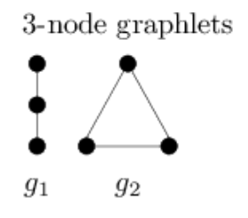

## 1.1 Effect of Depth on Expressiveness 

Three message passing layers are needed to distinguish the two red nodes.

 Layer 1 aggregates information from identical nodes 5. Layer 2 reaches identical nodes 4 and 6. Layer 3 reaches different nodes in each graph, making them distinguishable.

 Thus, at least 3-layer GNN is necessary.

 ## 1.2 Random Walk Matrix
 ### 1
 The random walk transition matrix is
 $$
M=
\begin{bmatrix}
0 & 1/2 & 1/2 & 0\\
1/2 & 0 & 1/2 & 0\\
1/3 & 1/3 & 0 & 1/3\\
0 & 0 & 1 & 0
\end{bmatrix}
$$
### 2
The limiting distribution r, such that r=Mr, is
$$
r=(1/4,1/4,1/4,1/4)
$$
It is a probability distribution, $\sum_i r_i = 1$.

## 1.3 Relation to Random Walk (i)
The random walk transition matix:
$$
M = D^{-1}A
$$
One can show that each row is normalized, $\forall i: \sum_j M_{ij} = 1$, so it has proper probabilistic property.

## 1.4 Relation to Random Walk (ii)
The random walk transition matix with skip connection:
$$
M = \frac{1}{2}I + \frac{1}{2}D^{-1}A
$$
Likewise to the previous case, $\forall i: \sum_j M_{ij} = 1$.

## 1.5 Over-Smoothing Effect
We need to apply the random walk transition matix infinite number of times to an arbitrary initial state vector $r$ and investigate the resulting state $r'$:
$$
r' = \lim_{l\to\infty}M^{l}r
$$
to show it has all identical components.

First, we can show that $v_1 = \frac{1}{\sqrt{n}} \hat{I}$ (n is the total number of nodes) is the eigenvector of the random walk matrix associated with eigenvalue $\lambda =1$:
$$
(Mv_1)_i= \frac{1}{\sqrt{n}}M\hat{I} = \frac{\sum_{j\in N(i)}\frac{1}{d_j}}{\sqrt{n}}= \frac{1}{\sqrt{n}} = (v_1)_i
$$
Contributions corresponding to eigenvalue $\lambda = 1$ will survive as $l$ grows. Using the spectral decompisition, we get:
$$
r' \approx (v_1\cdot v_1^T) r  = \frac{\sum_i r_i}{n} \hat{I} = \frac{1}{n} \hat{I}
$$
So, the resulting state $r'$ has all identical components regardless of the initial state $r$ distrbition. 

We can generalize this to embeddings matrix $H$ with each row containing nodes embeddings:
$$
h'_{ij} = \lim_{l\to\infty}(M^{l} H)_{ij} \approx \sum_{k}(v_1\cdot v_1^T)_{ik} H_{kj} = \frac{1}{n}\sum_k H_{kj}
$$
Thus resulting embedding vectors for all nodes $i$ are identical having components $j$ as shown in the above formular.

## 1.6 Learning BFS with GNN

BFS algorythm:
* Source node $𝑠$
* Initial input: 
$$h_i^{(0)}=\begin{cases}
1 & \quad \text{if  $i=s$}\\ 
0 & \quad \text{otherwise}
\end{cases}
$$
* Node is reachable from 𝑠 if any of its neighbors are reachable:
$$h_i^{(t+1)}=\begin{cases}
1 & \quad \text{if  $h_i^{(t)}=1$}\\ 
1 & \quad \text{if  $\exists j$ s.t. $(i,j)\in E$ and $h_j^{(t)}=1$}\\ 
0 & \quad \text{otherwise}
\end{cases}
$$

This can be rewriten in matrix notation.
Initially, the embedding matrix is diagonal: 
$$
H^{(0)} = \hat{I}
$$
After first step, each node gets updated with visits from each nearest neigbour:
$$
H^{(1)} = \hat{I} + A = (\hat{I} + A)H^{(0)}
$$
After $t+1$ steps:
$$
H^{(t+1)} = \theta\left((\hat{I}+ A)H^{(t)}\right)
$$
where
$$
\theta(x) = \begin{cases}
1 & \quad \text{if  $x>0$}\\ 
0 & \quad \text{otherwise}
\end{cases}
$$
to ensure that visited nodes get value 1 each. 

More explicetly, 
$$
h_{\nu}^{(l)} = \theta\left(h_{\nu}^{(l-1)} + \sum_{u\in N(\nu)}h_{u}^{(l-1)}\right)
$$
Messages are row embeddings, an aggregation is their sum, an update rule is applying $\theta$ to the sum in the brackets in the above formula.

## 2.1 Simple matrix factorization
Decoder
$$
DEC(z_{\nu}^Tz_u) = z_{\nu}^Tz_u
$$

## 2.2 Alternate matrix factorization
The optimization objective is
$$
\min_Z ||A-Z^TWZ||
$$

## 2.3 BONUS: Relation to eigen-decomposition
If $W$ is diagonal containing eigenvalues of $A$, then the above matrix decomposition is equivalent to learning the eigen-decomposition of matrix A.

## 2.4 Multi-hop node similarity

k-hop adjecency matrix is $A_k = A+A^2+...+A^k$. The optimization objective is
$$
\min_Z ||A_k-Z^TZ||
$$

## 2.5 node2vec & struct2vec (i)
Node2vec's reliance on biased random walks for neighborhood exploration makes it inherently less capable of consistently capturing structural similarity across disparate graph regions. While it can encode local structural features within densely connected subgraphs, the likelihood of random walks transitioning between weakly connected cliques is often insufficient to reliably model their structural equivalence. Consequently, node embeddings generated by node2vec might not accurately reflect the structural similarity of two cliques, particularly if they are situated in relatively isolated parts of the graph.

## 2.6 node2vec & struct2vec (ii)
 In a single step of node2vec's biased random walks, the algorithm can only transition to a node directly connected to the current node. This means that from a starting node within a clique, the algorithm can only immediately reach other nodes within that same clique.

 In contrast, struct2vec's multi-hop neighborhood sampling strategy allows it to reach nodes beyond immediate neighbors in a single step. The specific nodes reachable depend on the value of the hyperparameter $k$
​	
 
* For $g_k=1$, struct2vec's behavior is similar to node2vec, only exploring direct neighbors.
* For higher values of $k$, struct2vec can sample nodes at a distance of k hops from the starting node. If k is sufficiently high, struct2vec could potentially reach nodes in a different clique within a single step, even if they are not directly connected.

 ## 2.7 node2vec & struct2vec (iii)
 Incorporating multi-hop neighborhood exploration with varying values of $g_k$
​during random walks is crucial for enhancing the ability to capture diverse structural properties within a graph. By systematically considering different $g_k$ values, the algorithm can:

* Access nodes at varying distances from the starting node, extending its reach beyond immediate neighbors.
* Compare structural features of nodes across different graph regions, effectively identifying structural similarities and differences that might be overlooked when only considering local neighborhoods.
* Gain a more comprehensive understanding of the global graph structure, as it builds a more holistic representation of node relationships and their interconnectedness.

## 2.8 node2vec & struct2vec (iv)
struct2vec has a strong potential to assign similar embeddings to nodes in structurally equivalent cliques. Hence, it is expected that nodes in the two cliques will get similar embeddings.

## 3.1 Isomorphism Check
The 2 graphs are isomorphic via the mapping:

A - 6,
B - 2,
C - 1,
D - 5,
E - 7,
F - 3,
G - 4,
H - 8.

## 3.2 Aggregation Choice
Lets consider 3-node graphlets and assume that all nodes in both graphs initially have $h_{v_i}^0 = 1$ for $i\in(1,2)$:

It is easy to show that the updated features of all nodes in both graphs  are equal $h_{v_1}^1 = h_{v_2}^1 = 1$ if we use mean and max aggregation. If we use sum aggregation, the upper and lower nodes in $g_1$ will get $h_{v_1}^1 = 1$ , while the remaining node will get $h_{v_1}^1 = 2$. Likewise all nodes in $g_2$ will get $h_{v_2}^1 = 2$ if we use sum aggregation.