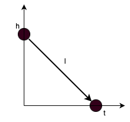
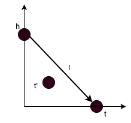
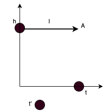

## 1 Node Embeddings with TransE 

### 1.1 Simplified Objective
Lets consider a graph consisting of just 2 nodes $h$ and $g$ and a directed edge between them $l$, such that true relationship should sutisfy $h+l = g$ with non-trivial emdebiings vectors. For example we could have: $h=(0,1)$, $l=(1,-1)$, $t = (1,0)$. 

However, one can easily check that the simplified objective function $\cal{L}_{\text{simple}}$
could go down to zero if $h=t$ and $l=0$ for any $h$ (or $t$). Those embeddings values do not make sence for the graph presented above. 
 
 ### 1.2 Utility of $\gamma$

 Lets consider a 3-node graph presented below. The node $t'$ is related neither to $h$ nor $t$.

The desired embeddings are $h=(0,1)$, $l=(1,-1)$, $t = (1,0)$ and $t'=(\sqrt{1/2},\sqrt{1/2})$. Easy to check that the corresponding objective function $\cal{L}_{\text{no margin}} =  0$. 

For any other values of embeddings such that $d(h+l,t) - d(h+l,t') < 0$ and all them being normalized appropriatelly, the objective function $\cal{L}_{\text{no margin}}=0$ as well. We just need to make sure that the vector $t'$ is further away from $h+l$ than the vector $t$. 

For instance, lets assume $h=(0,1)$, $l=(2,-1)$ (incorrect), $t = (1,0)$ and $t'=(\sqrt{1/2},\sqrt{1/2})$. Then those values will satisfy $\cal{L}_{\text{no margin}} = 0$ as well, since the distance from $A$ to $t$ is shorter than to $t'$.

The purpose of the margin $\gamma > 0$ is to panalise the arbitrariness of embeddings values, by correcting the sign  $\gamma + d(h+l,t) - d(h+l,t') > 0$ making $\cal{L}_{\text{no margin}}>0$.

In our case, we need to make sure that the margin $\gamma$ is greater than 0.47 (wrong difference) but less than 0.765 (true difference).

### 1.3 Normalizing the embeddings 

For any values of $\gamma$, $h$, $t$ and $l$, there will always be a value $t'$ (with any arbitrary norm) to make the term $\gamma + d(h+l,t) - d(h+l,t') < 0$. Normalization of embeddings is necessary to preclude such behaviour.

### 1.4 Expressiveness of TransE embeddings 

## 2 Expressive Power of Knowledge Graph Embeddings

#### 2.1 TransE Modeling

* Symmetry: TransE can not model it, since that would imply $l=-l$, which would lead to $l=0$.

* Inverse: TransE can model it, since 2 different relations have two different embeddings such that $l_{\text{AB}} = -l_{\text{BA}}$

* Composition: Yes again, since $l_{\text{CA}} + l_{\text{AB}} = l_{\text{CB}}$.

#### 2.2 RotatE Modeling

* Symmetry: One would need to assure $h\circ l = t$ as well as $t \circ l = h$. This possible if angles $l$ are $180^\circ$, and the vectors $h$ and $t$ are opposite to each other, e.g. $h=-t$ in 2D space. 

* Inverse: Yes, since there will be 2 different rotations, such that $h\circ l_{\text{AB}} = t$ and $t\circ l_{\text{BA}} = h$.

* Composition: Yes agaain, rotations can be composed $l_{\text{CA}} \oplus l_{\text{AB}} = l_{\text{CB}}$

#### 2.3 Failure Cases

Both models can not model 1 to many relationships.

## 3 Queries on Knowledge Graphs

